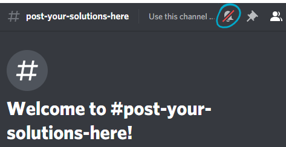
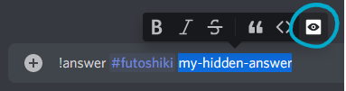

# JigsawBot

Bot for the puzzles discord server https://discord.gg/2eBhcVm

 

## Instructions

1. Each channel is an independent puzzle.
1. Use **#general** to talk about puzzles/ask for hints.
1. Mute the **#post-your-solutions-here** channel so you don't get notified when answers are entered. 
1. Use **#post-your-solutions-here** for posting an answer to a puzzle.
1. It's not mandatory, but it is recommended that you put your answer within spoiler tags so you don't risk to spoil the solution to others. You can either wrap the answer in `||` tags: 
`!answer #futoshiki ||my hidden answer||` or you can do it from the right-click menu like shown in the image: 
1. Channels are ordered by difficulty; easiest to hardest.
1. Type `!help` in **#post-your-solutions-here** or **#general** to receive the list of commands from the bot.

 

## Useful links

### [Encodings](https://puzzlehunt.azurewebsites.net/nipd2020/play/encodings)
### [Puzzle Solving Tools](https://puzzlehunt.azurewebsites.net/nipd2020/play/tools)

 

## How are points awarded?

- Each puzzle starts at **1200** points
- A puzzle's points are divided among all the players who solved it with the fomula: `120 + 1080 / solves`
- Each time a puzzle is solved, the score is updated for every player who solved that puzzle
- A puzzle's score cannot go below **120**
